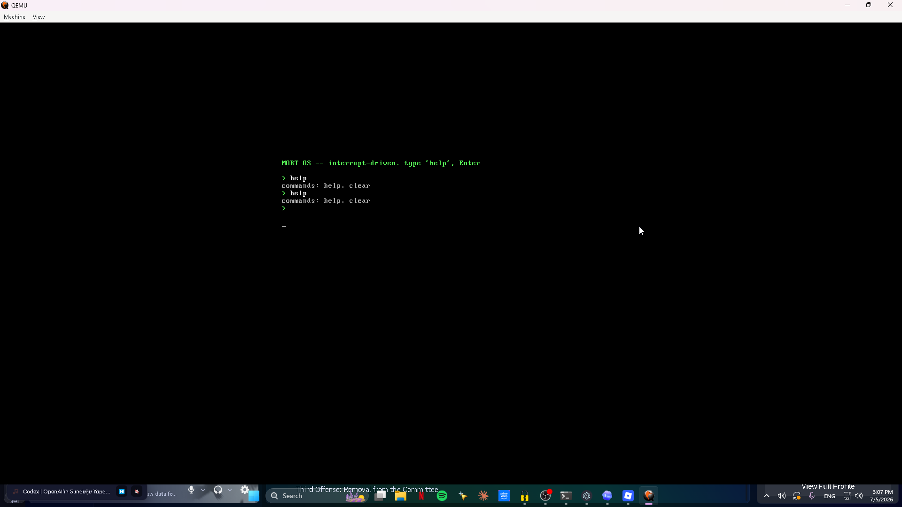

# Mort

[](https://github.com/0xmortuex/Mort/actions/workflows/ci.yml)
&nbsp;
&nbsp;

**A small, statically-typed programming language that compiles to C.** Written from scratch in Python — lexer, parser, type checker, and a C code generator, no libraries.

Mort exists for a bigger goal: **build a language, then write an operating system kernel in it** — and it now does exactly that. The same compiler that runs `hello.mx` also builds [MORT OS](kernel/), a multiboot kernel written in Mort that boots in QEMU, sets up an IDT, remaps the PICs, and takes **interrupt-driven keyboard input** into an interactive shell. That's why Mort compiles to freestanding-friendly C instead of running on an interpreter.



<sub>MORT OS booted in QEMU — the shell, keyboard driver, and command parser are all written in Mort.</sub>

```rust
// examples/fib.mx
fn fib(n: int) -> int {
    if n < 2 {
        return n;
    }
    return fib(n - 1) + fib(n - 2);
}

fn main() -> int {
    let i = 0;
    while i < 10 {
        print(fib(i));
        i = i + 1;
    }
    return 0;
}
```

```
$ python mortc.py examples/fib.mx --run
0
1
1
2
3
5
8
13
21
34
```

## How it works

Mort is a classic multi-pass compiler. Source text flows through five stages:

```
 .mx source
     │  Lexer          mort/lexer.py        text  → tokens
     │  Parser         mort/parser.py       tokens → AST   (recursive descent)
     │  Checker        mort/typechecker.py  static type checking + inference
     │  CodeGen        mort/codegen.py      AST   → C11 source
     ▼  C compiler     (cc / gcc / clang / zig)   C → native executable
 a.out
```

The type checker annotates every expression with its resolved type, and codegen
lowers each Mort function to a `mort_<name>` C function (so a Mort program can
never clash with a C standard-library symbol). Your `main` is wrapped by a real
C `main`, so the output is an ordinary native binary.

## The language (v0.7)

- **Types:** `bool`, `int` (alias for `i64`), the fixed-width integers
  `i8 i16 i32 i64 u8 u16 u32 u64`, and user **structs**.
- **Strings:** string literals `"hi"` are `*u8` — a pointer to static,
  NUL-terminated bytes. Walk them by casting the pointer to an integer, adding
  an offset, and casting back (used by the kernel's `print_string`).
- **Arrays:** fixed-size `[T; N]` with literal (`[1, 2, 3]`) or repeat
  (`[0; 8]`) initialisers and `a[i]` indexing (read and write).
- **Structs:** `struct Point { x: i64, y: i64 }`, construct with
  `Point { x: 3, y: 4 }`, read/write fields with `p.x`, pass by value, and
  mutate through a pointer with `(*p).x = 1;`.
- **Pointers:** `*T` types, address-of `&x`, dereference `*p`, and writing
  through a pointer with `*p = value;`.
- **Casts:** `expr as T` between integer types and pointers — e.g.
  `0xB8000 as *u8` to point at raw memory.
- **Inline assembly:** `asm("hlt");` — an escape hatch to real instructions,
  lowered to the C compiler's `__asm__ volatile`.
- **Functions:** `fn name(a: int, b: int) -> int { ... }`, with recursion and any call order.
- **Variables:** `let x = 5;` (inferred) or `let x: u32 = 5;` (annotated).
- **Control flow:** `if` / `else if` / `else`, `while`, and range `for`
  (`for i in 0..n { ... }`, or `for i: u32 in 0..n` to fix the counter's type).
- **Operators:** `+ - * / %`, `== != < > <= >=`, `&& || !`, bitwise `& | ^ << >> ~`, unary `-`.
- **Literals:** decimal and hex (`0xFF`); untyped integer literals adopt the
  integer type they're used with, so `let b: u8 = a + 5;` needs no cast.
- **Globals:** top-level `let name: type = <constant>;` — file-scope state shared
  across functions (used by the kernel's interrupt handler).
- **Builtins:** `print(<any integer>)` (hosted), plus `outb(port: u16, value: u8)`
  and `inb(port: u16) -> u8` for x86 port I/O (lowered to inline `in`/`out`).
- **Comments:** `// to end of line`.

Everything is statically type-checked before a single line of C is emitted:
mismatched types, mixing integer widths without a cast, dereferencing a
non-pointer, taking the address of a non-lvalue, undefined names, wrong argument
counts, and a non-`bool` `if` condition are all compile-time errors with line
numbers.

## Usage

```bash
python mortc.py program.mx              # compile to a native executable
python mortc.py program.mx --run        # compile, then run it
python mortc.py program.mx --emit-c     # print the generated C and stop
python mortc.py program.mx -o myprog    # choose the output name
python mortc.py kernel.mx --freestanding  # bare-metal object (no libc, no main)
```

### Freestanding / bare metal

`--freestanding` is the bridge to the kernel. It drops everything that needs an
operating system underneath — no `<stdio.h>`, no `print`, no C `main` wrapper —
and emits an object file compiled with `-ffreestanding`. With the Zig backend it
cross-compiles to a real **x86-64 bare-metal ELF object** regardless of your host
OS. Addresses are computed as integers and cast to pointers, so hardware like the
VGA text buffer is reachable with no pointer-arithmetic feature:

```rust
// examples/kernel.mx — writes "Hi" to VGA memory, then halts.
fn put_cell(index: u64, ch: u8, color: u8) {
    let addr: u64 = 0xB8000 + index * 2;
    let cell: *u8 = addr as *u8;
    *cell = ch;
    let attr: *u8 = (addr + 1) as *u8;
    *attr = color;
}

fn kmain() {
    put_cell(0, 72, 15);   // 'H'
    put_cell(1, 105, 15);  // 'i'
    asm("hlt");
}
```
```
$ python mortc.py examples/kernel.mx --freestanding
mortc: wrote kernel.o          # a 64-bit x86-64 ELF object, no libc
```

### Requirements

- **Python 3.8+** — runs the compiler itself.
- **A C compiler** for the final native-build step. Mort looks for `cc`, `gcc`,
  or `clang` on your `PATH`, then falls back to Zig if it's installed.

No system compiler on Windows? The easiest option is a one-line install of Zig,
which ships a complete C compiler:

```bash
pip install ziglang        # Mort auto-detects and uses `python -m ziglang cc`
```

`--emit-c` needs no C compiler at all — it just prints the generated C.

## Tests

```bash
pip install pytest
python -m pytest tests/ -v
```

Front-end tests (type checking, error messages, codegen) always run. The
end-to-end tests compile each example to a real binary and check its output;
they skip automatically if no C compiler is available.

## Roadmap

- [x] **Phase 1 — Language core:** lexer, parser, type checker, C codegen, CLI.
- [x] **Phase 2a — Memory core:** fixed-width int types, `as` casts, pointers (`&`, `*`, deref-assignment), hex literals, raw address casts.
- [x] **Phase 2b — Aggregates & asm:** structs (fields, construction, by-value, pointer mutation) and an inline-assembly escape hatch (`asm("...")`).
- [x] **Phase 3 — Freestanding mode:** `--freestanding` drops libc/`print`/`main` and emits a real x86-64 bare-metal ELF object (via the Zig backend).
- [x] **Phase 4a — It boots:** a multiboot kernel written in Mort ([`kernel/`](kernel/)) that runs in QEMU and prints to VGA text mode. `python kernel/build.py run`.
- [x] **Phase 4b — Strings:** string literals (`*u8`) in the language and a `print_string` VGA routine written in Mort, so the kernel prints real messages.
- [x] **Phase 4c — A shell:** `inb`/`outb` builtins, PS/2 keyboard, Shift/digits, Backspace, and a command parser (`help`, `clear`).
- [x] **Phase 4d — Interrupts:** global variables in the language, plus a GDT/IDT and remapped PICs so the keyboard is **interrupt-driven** (IRQ1). A PIT timer on IRQ0 drives an `uptime` command, a blinking hardware cursor, and terminal-style scrolling round out the shell.

## License

MIT
