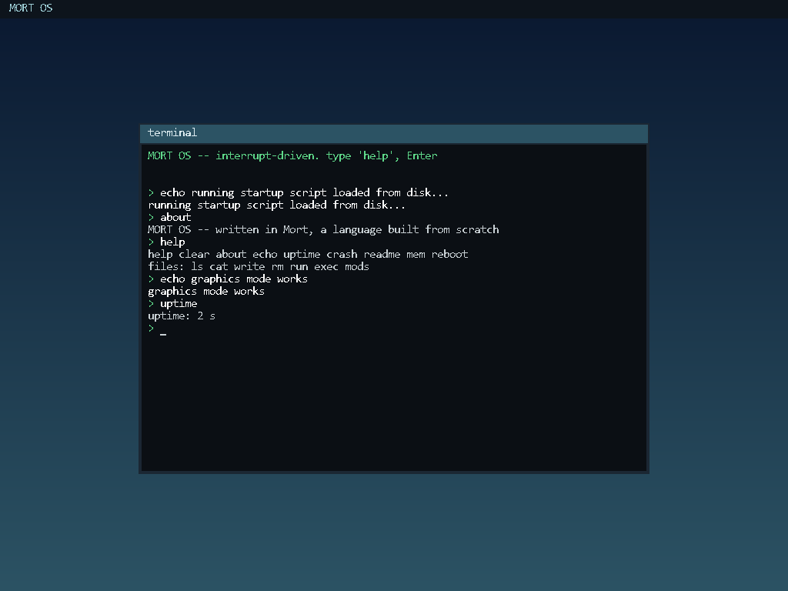

# Mort

[](https://github.com/0xmortuex/Mort/actions/workflows/ci.yml)
&nbsp;
&nbsp;

**A small, statically-typed programming language that compiles to C.** Written from scratch in Python — lexer, parser, type checker, and a C code generator, no libraries.

> **Status: alpha.** Mort is useful for native programs, C interoperability,
> experiments, and its own operating system, but it is not yet honest to call
> it error-free or suitable for every possible project. Releases are gated by
> native tests, adversarial fuzzing, package installation checks, and kernel
> builds on Linux, Windows, and macOS. The remaining production work is tracked
> in [the production-readiness checklist](docs/production-readiness.md).

Mort exists for a bigger goal: **build a language, then write an operating system kernel in it** — and it now does exactly that. The same compiler that runs `hello.mx` also builds [MORT OS](kernel/), a multiboot kernel written in Mort that boots in QEMU **and on real hardware** (BIOS/UEFI bootable ISO), sets up an IDT, remaps the PICs, and runs a **graphical desktop with multiple apps** — a Terminal, a Files manager, and a Vex-styled browser, switched with `F1`/`F2`/`F3` — all drawn to a linear framebuffer in a bitmap font. It has an ATA disk driver, **a real filesystem (MortFS)** whose files survive reboots, and it **runs real, interactive compiled programs** through `int 0x80` syscalls (a program can ask your name and greet you). That's why Mort compiles to freestanding-friendly C instead of running on an interpreter.

> 🖥️ The kernel also has its own showcase repo: [**0xmortuex/MortOS**](https://github.com/0xmortuex/MortOS) — buildable standalone (it fetches this compiler automatically).



<sub>MORT OS in graphics mode — a framebuffer desktop with the shell rendered in an 8×16 bitmap font, all written in Mort.</sub>

<sub>MORT OS booted in QEMU — the shell, keyboard driver, and command parser are all written in Mort.</sub>

```rust
// examples/fib.mx
fn fib(n: int) -> int {
    if n < 2 {
        return n;
    }
    return fib(n - 1) + fib(n - 2);
}

fn main() -> int {
    let i = 0;
    while i < 10 {
        print(fib(i));
        i = i + 1;
    }
    return 0;
}
```

```
$ python mortc.py examples/fib.mx --run
0
1
1
2
3
5
8
13
21
34
```

## How it works

Mort is a classic multi-pass compiler. Source text flows through five stages:

```
 .mx source
     │  Lexer          mort/lexer.py        text  → tokens
     │  Parser         mort/parser.py       tokens → AST   (recursive descent)
     │  Checker        mort/typechecker.py  static type checking + inference
     │  CodeGen        mort/codegen.py      AST   → C11 source
     ▼  C compiler     (cc / gcc / clang / zig)   C → native executable
 a.out
```

The type checker annotates every expression with its resolved type, and codegen
lowers each Mort function to a `mort_<name>` C function (so a Mort program can
never clash with a C standard-library symbol). Your `main` is wrapped by a real
C `main`, so the output is an ordinary native binary.

## The language (v0.37)

Mort 0.37 has a
[versioned normative language specification](docs/language-specification.md)
and a black-box [executable conformance suite](conformance/README.md). Run
`mortc --language-version` to print the implemented language contract.

- **Types:** `bool`, `int` (alias for `i64`), fixed-width integers, `f32`/`f64`,
  C-ABI integer types (`c_int`, `c_size`, etc.), structs, and enums.
- **Type aliases:** representation-transparent names such as
  `type UserId = u64;`, including aliases of nested generic types.
- **Tuples:** typed heterogeneous values such as `(i64, bool, *u8)`, created
  with `(42, true, "Mort")` and accessed or mutated by zero-based fields such
  as `value.0`. Tuples compose with aliases, generics, callbacks, structs,
  globals, arrays, slices, pointers, and `sizeof<T>()`.
- **Strings:** string literals `"hi"` are `*u8` — a pointer to static,
  NUL-terminated bytes, with `len(text)` and indexed access.
- **Arrays:** fixed-size `[T; N]` with literal (`[1, 2, 3]`) or repeat
  (`[0; 8]`) initialisers and `a[i]` indexing (read and write).
- **Slices:** length-aware `[]T` and read-only `[]const T`, created with
  `slice(pointer, length)`, passed by value, and checked when indexed.
- **Structs:** `struct Point { x: i64, y: i64 }`, construct with
  `Point { x: 3, y: 4 }`, read/write fields with `p.x`, pass by value, and
  mutate through a pointer with `(*p).x = 1;`.
- **Pointers:** `*T` types (including FFI-friendly `*void`), typed `null`,
  address-of `&x`, dereference `*p`, indexed access with `p[i]`, and writing
  through a pointer.
- **Casts:** `expr as T` between integer types and pointers — e.g.
  `0xB8000 as *u8` to point at raw memory.
- **Inline assembly:** `asm("hlt");` — an escape hatch to real instructions,
  lowered to the C compiler's `__asm__ volatile`.
- **Functions:** `fn name(a: int, b: int) -> int { ... }`, with recursion and any call order.
- **Function values and callbacks:** typed `fn(i64, i64) -> i64` values can be
  stored in bindings, globals, structs, and generic containers; passed to
  higher-order functions; invoked indirectly; returned from functions; and
  used in C callback signatures. Public imported functions can be captured
  through their module alias.
- **C interoperability:** declare a native C-ABI function with
  `extern fn name(arg: i32) -> i32;`, then call it like any checked Mort
  function. External functions can be used as callback values too.
- **Enums and matching:** payload-free, tagged-union, and generic variants such
  as `Option<T>` and `Result<Value, Error>`, with exhaustive destructuring
  match. Variants can carry multiple typed fields—`Point(i64, i64)` constructs
  with `Point(20, 22)` and matches as `Point(x, y)`; `_` ignores a field.
- **Generic structs:** monomorphized native layouts such as
  `struct Pair<Left, Right> { first: Left, second: Right }`.
- **Generic functions:** inferred calls such as `identity(42)` and explicit
  calls such as `vec.new<i64>()`, each monomorphized to checked native code.
- **Typed collections:** allocation-backed `Vec<T>` and `Map<Key, Value>` in
  `std.vec` and `std.map`. They are resource types and clean themselves up.
- **Ownership:** `resource struct` declares a move-only type with a checked
  `destroy(*Resource) -> void` contract. Resource bindings are destroyed
  automatically in reverse order on every lexical exit. Transfers use explicit
  `move value`; implicit copies, use-after-move, double moves, unsafe loop
  moves, global resources, and destructive overwrites are compile-time errors.
  Ownership composes through ordinary structs, tuples, tagged-enum payloads,
  and fixed arrays with recursively generated reverse-order destructors.
  `match move value` safely transfers an owning enum's active payload into its
  arm binding, and resources created inside loops can move once per iteration.
- **Portable standard modules:** environment access, process control, and
  generic integer math through `std.env`, `std.process`, and `std.math`, plus
  typed hosted file/time APIs through `std.fs` and `std.time`. Portable
  `std.random`, `std.bytes`, and `std.algorithm` add deterministic PRNGs,
  slice operations, sorting, reversal, containment, and indexed search.
- **Concurrency:** move-only `std.thread.Thread` and `std.mutex.Mutex`
  resources work across Windows, Linux, and macOS. `std.atomic.AtomicI64`
  supplies sequentially consistent atomic load/store, exchange, fetch
  arithmetic, and compare-exchange. Mort specifies spawn/join and mutex
  happens-before edges plus a concrete data-race rule.
- **TCP, UDP, and DNS:** move-only `std.net.Socket` resources provide blocking
  TCP connects/listeners/accepts and UDP bind/connected-peer sockets, partial
  or complete stream transfers, datagram send/receive with source endpoints,
  shutdown, and automatic closure across Windows, Linux, and macOS. Host-name
  resolution supports eligible IPv4 and IPv6 addresses through the native
  resolver.
- **Typed allocation:** `sizeof<T>()` supplies the portable byte size of any
  concrete Mort type.
- **Error propagation:** `try operation()` unwraps `Result.Ok` or returns a
  type-compatible `Result.Err` from the enclosing function. It works throughout
  eager expressions—including calls, arithmetic, assignments, struct/array
  values, indexing, matching, range bounds, conditions, and short-circuit
  boolean logic—while preserving evaluation order and lexical cleanup.
- **Variables:** `let x = 5;` (inferred) or `let x: u32 = 5;` (annotated).
- **Immutable bindings:** `const answer: i64 = 42;` for locals and globals,
  with protected fields, indices, and `*const T` address propagation.
- **Control flow:** `if` / `else if` / `else`, `while`, infinite `loop`, range
  `for`, `break`, and `continue`. Ranges may be exclusive (`0..n`) or inclusive
  (`0..=n`), evaluate each bound exactly once, and support an explicit counter
  type (`for i: u32 in 0..n`). Inclusive ranges remain safe at integer maxima.
- **Operators:** `+ - * / %`, `== != < > <= >=`, `&& || !`, bitwise
  `& | ^ << >> ~`, unary `-`, and the matching compound assignments such as
  `+=`, `*=`, `|=`, and `<<=`. Fixed-width runtime arithmetic wraps
  deterministically; shifts and signed division edge cases have specified
  behavior rather than inheriting C undefined behavior.
- **Literals:** decimal, hex (`0xFF`), binary (`0b1010`), octal (`0o755`),
  character (`'A'` and `'\n'`), floating point, and readable numeric separators
  (`1_000_000`). Untyped integer literals adopt the integer type they're used
  with, so `let b: u8 = a + 5;` needs no cast.
- **Globals:** top-level `let name: type = <constant>;` — file-scope state shared
  across functions (used by the kernel's interrupt handler).
- **Hosted runtime:** `print`, `println`, `assert`, `len`, `alloc`, and `free`,
  with compile-time and runtime array bounds validation.
- **Cleanup:** resource destruction and lexical `defer expression;` execute in
  reverse order on normal scope exits, returns, `break`, `continue`, and
  propagated errors. Existing explicit `defer module.destroy(&value)` remains
  compatible and suppresses the matching implicit cleanup.
- **Hardware builtins:** the x86 port-I/O family
  (lowered to inline `in`/`out`): `outb`/`inb` (8-bit), `outw`/`inw` (16-bit),
  and `outl`/`inl` (32-bit, for PCI config space on ports `0xCF8`/`0xCFC`).
- **Comments:** `// to end of line` and nestable `/* block comments */`.

Everything is statically type-checked before a single line of C is emitted:
mismatched types, mixing integer widths without a cast, dereferencing a
non-pointer, taking the address of a non-lvalue, undefined names, wrong argument
counts, and a non-`bool` `if` condition are all compile-time errors with line
numbers.

## Usage

Install Mort once, then use `mortc` from any directory:

```bash
# Latest published Git version:
python -m pip install --upgrade git+https://github.com/0xmortuex/Mort.git

# Or a live editable development checkout:
python -m pip install -e .
mortc --version
mortc doctor
mortc std
mortc new hello
```

The editable install follows this checkout as Mort evolves, so newly published
compiler changes become available machine-wide without reinstalling.

```bash
python mortc.py program.mx              # compile to a native executable
python mortc.py program.mx --run        # compile, then run it
python mortc.py program.mx --emit-c     # print the generated C and stop
python mortc.py program.mx --check      # parse and type-check without a C backend
python mortc.py bad.mx --check --diagnostic-format json  # editor/CI diagnostics
python mortc.py app.mx --check --warn-unused --deny-warnings
python mortc.py lsp                     # start the stdio language server
python mortc.py fuzz --cases 1000 --seed 0  # deterministic front-end fuzzing
python mortc.py app.mx -O3 -g           # backend optimization/debug controls
python mortc.py app.mx --run --sanitize address --sanitize undefined
python mortc.py program.mx -o myprog    # choose the output name
python mortc.py main.mx math.mx --run   # one program split across source files
python mortc.py app.mx --std string     # include a bundled standard module
python mortc.py app.mx --link add.o     # link a native object/library file
python mortc.py app.mx -l sqlite3       # link a system library by name
python mortc.py kernel.mx --freestanding  # bare-metal object (no libc, no main)
```

`mortc lsp` speaks standard Language Server Protocol over stdio. It provides
live import-aware diagnostics, keyword/type/builtin and source-symbol
completion, document outlines, signature hovers, nested-call signature help,
and whole-document formatting. The server has no third-party dependencies and
continues offering baseline completions while a file is temporarily incomplete.

### Projects

```bash
mortc new hello       # create mort.toml, src/, tests/, and .gitignore
cd hello
mortc build
mortc run
mortc test            # compile and run test "name" { ... } blocks
mortc fmt              # format project sources and tests
mortc fmt --check      # CI-friendly formatting check
mortc add util --path ../util  # add a local package and update mort.lock
mortc add json --git URL --ref v1.0.0  # fetch and pin a Git package
mortc add json --registry '^1.2.0'  # highest compatible public release
mortc fetch            # resolve dependencies and refresh the lockfile
mortc fetch --locked   # verify the lockfile without changing it
mortc fetch --offline  # use cached index/checkouts and configured mirrors
```

Project builds are content-addressed: unchanged sources, dependencies,
configuration, standard modules, and compiler versions reuse the existing
native output without invoking the C backend.

Hosted builds can enable `address`, `undefined`, `leak`, and `thread` C-backend
sanitizers with repeated `--sanitize` options or a project setting such as
`sanitizers = ["address", "undefined"]` in `[build]`. Set `MORT_CC` (or the
standard `CC`) to select a particular backend command, for example
`MORT_CC=clang`. ThreadSanitizer may be combined with UndefinedBehaviorSanitizer
but not with address or leak sanitizers.

Imports are resolved recursively relative to the importing file. Bundled modules
use the `std` prefix:

```rust
import math;
import std.string;
```

Files can opt into collision-free module namespaces with private-by-default
functions and explicit public APIs:

```rust
// math.mx
module tools.math;
fn helper(x: i64) -> i64 { return x * 2; }
pub fn double(x: i64) -> i64 { return helper(x); }

// main.mx
import math as numbers;
// numbers.double(21)
```

All source files in one command form a single statically checked program and
share top-level functions, structs, and globals. Exactly one hosted `main`
function is required.

Bundled modules include modern importable `std.option`, `std.result`, `std.vec`,
`std.map`, `std.math`, `std.algorithm`, `std.random`, `std.bytes`, `std.env`,
`std.process`, `std.fs`, `std.time`, `std.thread`, `std.mutex`, and
`std.atomic` modules. Legacy flat `string`, `memory`, and allocation-backed
`owned_string` modules remain available through the repeatable `--std` option.
Every module is Mort source and remains fully type-checked in the consuming
program.

### Calling C and native libraries

`extern fn` is Mort's bridge to the native ecosystem. It declares a symbol but
does not generate its body; the linker resolves that symbol from the platform C
runtime, a file passed with `--link`, or a library passed with `-l`.

```rust
// C runtime function
extern fn abs(value: i32) -> i32;

fn main() -> int {
    print(abs(0 - 42));
    return 0;
}
```

External calls are checked for argument count and Mort types. Fixed-width and
C-native integer types are available, along with `*void` handles and read-only
`*const T` pointers. See [`examples/interop.mx`](examples/interop.mx).

### Freestanding / bare metal

`--freestanding` is the bridge to the kernel. It drops everything that needs an
operating system underneath — no `<stdio.h>`, no `print`, no C `main` wrapper —
and emits an object file compiled with `-ffreestanding`. With the Zig backend it
cross-compiles to a real **x86-64 bare-metal ELF object** regardless of your host
OS. Addresses are computed as integers and cast to pointers, so hardware like the
VGA text buffer is reachable with no pointer-arithmetic feature:

```rust
// examples/kernel.mx — writes "Hi" to VGA memory, then halts.
fn put_cell(index: u64, ch: u8, color: u8) {
    let addr: u64 = 0xB8000 + index * 2;
    let cell: *u8 = addr as *u8;
    *cell = ch;
    let attr: *u8 = (addr + 1) as *u8;
    *attr = color;
}

fn kmain() {
    put_cell(0, 72, 15);   // 'H'
    put_cell(1, 105, 15);  // 'i'
    asm("hlt");
}
```
```
$ python mortc.py examples/kernel.mx --freestanding
mortc: wrote kernel.o          # a 64-bit x86-64 ELF object, no libc
```

### Requirements

- **Python 3.10+** — runs the compiler itself.
- **A C compiler** for the final native-build step. Mort looks for `cc`, `gcc`,
  or `clang` on your `PATH`, then falls back to Zig if it's installed.

No system compiler on Windows? The easiest option is a one-line install of Zig,
which ships a complete C compiler:

```bash
pip install ziglang        # Mort auto-detects and uses `python -m ziglang cc`
```

`--emit-c` needs no C compiler at all — it just prints the generated C.

## Tests

```bash
pip install pytest
python -m pytest tests/ -v
```

Front-end tests (type checking, error messages, codegen) always run. The
end-to-end tests compile each example to a real binary and check its output;
they skip automatically if no C compiler is available.

Mort projects can also declare native tests:

```rust
test "addition" {
    assert(add(2, 3) == 5);
}
```

## Roadmap

- [x] **Phase 1 — Language core:** lexer, parser, type checker, C codegen, CLI.
- [x] **Phase 2a — Memory core:** fixed-width int types, `as` casts, pointers (`&`, `*`, deref-assignment), hex literals, raw address casts.
- [x] **Phase 2b — Aggregates & asm:** structs (fields, construction, by-value, pointer mutation) and an inline-assembly escape hatch (`asm("...")`).
- [x] **Phase 3 — Freestanding mode:** `--freestanding` drops libc/`print`/`main` and emits a real x86-64 bare-metal ELF object (via the Zig backend).
- [x] **Phase 4a — It boots:** a multiboot kernel written in Mort ([`kernel/`](kernel/)) that runs in QEMU and prints to VGA text mode. `python kernel/build.py run`.
- [x] **Phase 4b — Strings:** string literals (`*u8`) in the language and a `print_string` VGA routine written in Mort, so the kernel prints real messages.
- [x] **Phase 4c — A shell:** `inb`/`outb` builtins, PS/2 keyboard, Shift/digits, Backspace, and a command parser (`help`, `clear`).
- [x] **Phase 4d — Interrupts:** global variables in the language, plus a GDT/IDT and remapped PICs so the keyboard is **interrupt-driven** (IRQ1). A PIT timer on IRQ0 drives an `uptime` command, a blinking hardware cursor, and terminal-style scrolling round out the shell.

- [x] **Phase 5 — Real-project foundations:** multi-file compilation, typed C-ABI
  `extern fn` declarations, native object/library linking, `*void`, and
  `break`/`continue` loop control.
- [x] **Phase 6a — Project workflow:** recursive imports, bundled modules,
  `mort.toml`, and `new`/`build`/`run`/`test` commands.
- [x] **Phase 6b — Safety and testing:** guaranteed returns, checked array
  indexing, allocation primitives, enums, exhaustive match, and native tests.
- [x] **Phase 7a — Core tooling:** source excerpts in diagnostics and a
  comment-preserving formatter with check mode.
- [x] **Phase 7b — Namespaces and local packages:** module aliases, `pub`
  visibility, path dependencies, dependency graphs, and deterministic lockfiles.
- [x] **Phase 8a — Safe data foundations:** typed mutable/const slices and an
  allocation-backed owned-string module.
- [x] **Phase 8b — Ecosystem tooling:** build caching, JSON diagnostics,
  formatter, LSP diagnostics/completion/navigation/formatting, wheel packaging,
  machine-wide installs, and tagged GitHub release artifacts.
- [x] **Phase 9a — Algebraic and generic foundations:** payload-carrying enums,
  exhaustive payload bindings, and monomorphized generic structs.
- [x] **Phase 9b — Generic ecosystem:** generic functions/enums, `Option<T>`,
  `Result<T,E>`, `try`, and reusable `Vec`, `Map`, and slice algorithms.
- [x] **Phase 10a — Portable dependencies and cleanup:** cached Git packages,
  commit-pinned portable lockfiles, and return-safe function-scoped `defer`.
- [x] **Phase 10b — Ownership:** resource contracts, move checking,
  branch-aware ownership dataflow, automatic destructors, and recursive cleanup
  for structs, tuples, tagged-enum payloads, and arrays.
- [x] **Phase 10c — Remote ecosystem:** SemVer 2.0 range solving, tagged Git
  releases, the public registry index, deterministic version+commit lockfiles,
  cached resolution, and configurable offline mirrors.
- [x] **Phase 10d — Reliability hardening:** revision-correct Git dependency
  caches, bounded and schema-validated registry indexes, dependency-root
  confinement, controlled deep-nesting diagnostics, structured adversarial
  fuzzing, cross-platform CI, and release-blocking validation.

## License

MIT
